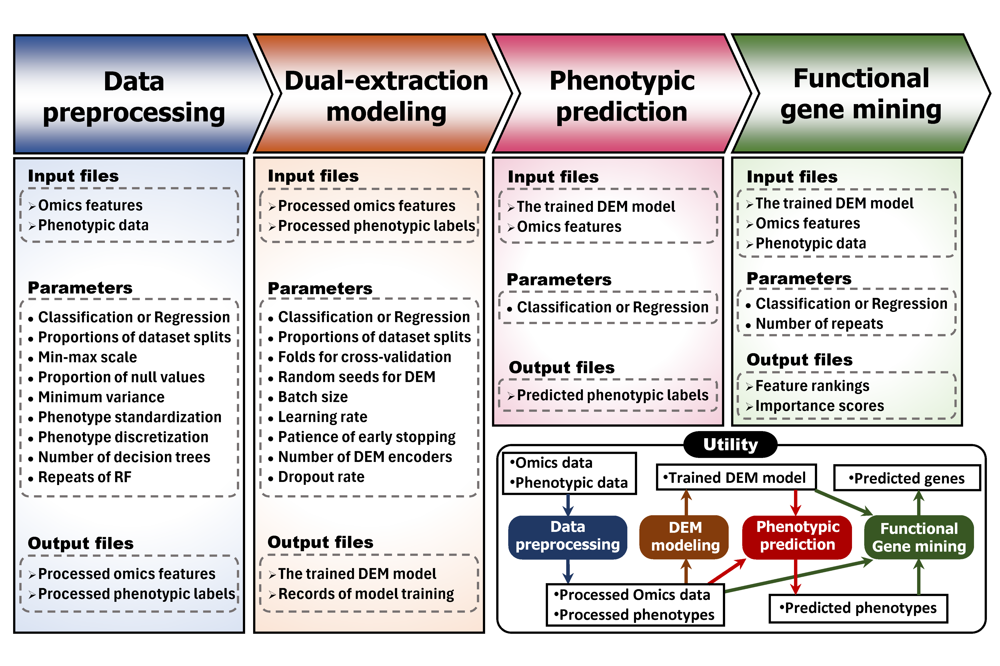

<div align="center">

# DEM

### Dual-extraction method for phenotypic prediction and functional gene mining

[](https://pypi.org/project/biodem)
[](https://opensource.org/licenses/MIT)

</div>

> The **DEM** software comprises 4 functional modules: data preprocessing, dual-extraction modeling, phenotypic prediction, and functional gene mining.  

<br></br>

---

## Directory structure
```sh
.
├── src                        # Python, Julia and R implementation for DEM
├── data                       # Data files and example files
├── tests                      # Easy tests for packages and pipelines
├── pyproject.toml             # Python package metadata
├── LICENSE
└── README.md

./src/biodem
├── module1_predata.py         # Module 1: Data preprocessing
├── module2_model.py           # Module 2: Dual-extraction modeling
├── module3_predict.py         # Module 3: Phenotypic prediction
├── module4_mining.py          # Module 4: Functional gene mining
├── __init__.py                # Initialize the Python package
├── cli_dem.py                 # Command line interface for DEM
└── utils_model.py             # Utilities for modeling and prediction

./src/DEMpre
├── Manifest.toml                    # Julia package metadata
├── Project.toml                     # Julia package metadata
└── src
    ├── DEMpre.jl                    # Initialize the Julia package
    └── modules
        ├── module_SearchSNP.jl      # Search the nearest genic/intergenic region of SNP from GTF file
        ├── module_DimsReduction.jl  # Train the model and transform SNP data
        ├── module_InterpretModel.jl # Get the parameters of the model for transformation interpretation
        ├── models.jl                # Model for SNP transformation
        ├── types.jl                 # Self-defined data types
        ├── utils_dl.jl              # Utilities for modeling
        └── utils.jl                 # Utilities for IO and multithreading

```

---

<br></br>

> **DEM is mainly implemented in Python. You may use the Julia package [DEMpre.jl](#dem-provides-the-julia-package-demprejl) in some steps to process and transform SNP data.**

# DEM has the Python package [biodem](https://pypi.org/project/biodem)
## which includes 4 functional modules:



### 1. Data preprocessing

+ _Steps:_
    1. Imputation & min-max scaling
    2. Feature selection using the variance threshold method, PCA, and random forests for multi-omics data.
    3. SNP transformation
    
+ _Related functions:_
    1. [**`dem-impute`**](#dem-impute)
    2. [**`dem-select-varpca`**](#dem-select-varpca), [**`dem-select-rf`**](#dem-select-rf)
    3. (In Julia) [**`search_gene_of_snp`**](#search_gene_of_snp), [**`train4embed`**](#train4embed), [**`transform_snp`**](#transform_snp)

### 2. Dual-extraction modeling

+ It takes preprocessed multi-omics data and phenotypic data as inputs for training and validation, based on which the DEM model is constructed. It is capable of performing both classification and regression tasks.
    
+ _Related function:_
    + [**`dem-model`**](#dem-model)

### 3. Phenotypic prediction

+ It takes trained model and omics data of new/test samples as inputs and returns the predicted phenotypic values.

+ _Related function:_
    + [**`dem-predict`**](#dem-predict)

### 4. Functional gene mining

+ It performs functional gene mining based on the trained DEM model through _feature permutation_.

+ _Related function:_
    + [**`dem-rank`**](#dem-rank)

---

<br></br>

## System requirements
+ Python 3.10 or 3.11.
+ Graphics: GPU with [PyTorch](https://pytorch.org) support.
> Recommended: NVIDIA graphics card with 12GB memory or larger.

## Install biodem

> [Conda](https://conda.io/projects/conda/en/latest/index.html) / [Mamba](https://mamba.readthedocs.io/en/latest/installation/mamba-installation.html) or virtualenv is recommended for installation.

1. Create a conda environment:
    ```sh
    conda create -n dem python=3.11
    conda activate dem

    # Install PyTorch with CUDA support
    conda install pytorch torchvision torchaudio pytorch-cuda=12.1 -c pytorch -c nvidia
    ```

2. Install biodem package:
    + Simple installation from [PyPI](https://pypi.org/project/biodem)
        ```sh
        pip install biodem
        ```

    + Get biodem package and install from local
        Click to download: https://github.com/cma2015/DEM/blob/main/dist/biodem-0.2.0-py3-none-any.whl
        ```sh
        pip install biodem-0.2.0-py3-none-any.whl
        ```

A pipeline for testing is provided in [**`./test/test_biodem.py`**](test/test_biodem.py).
```sh
cd test
python test_biodem.py
```

---

<br></br>

## Input and output file formats
Please refer to the directory [**`./data`**](data/) for **the file formats** that will be used in following methods.

---

<br></br>

## How to use `biodem`
We provide both [**command line tools**](#use-command-line-tools) and [**importable functions**](#import-biodem-in-your-python-project) for `biodem`.

<br></br>

### Use command line tools

> In terminal, run the command like `dem-impute --help` or `dem-impute -h` for help.

+ #### `dem-impute`
    <br>The tool contains 3 steps:</br>
    1. Delete omics features with missing values exceeding 25%.
    2. Impute missing values with mean value of each feature.
    3. Min-max scaling.
    ```sh
    # Usage:
    dem-impute -I <an_omics_file_in> -O <an_omics_file_out> -i <a_phenotypes_file_in> -o <phenotypes_out> -p <NA_threshold> -m <is_minmax_omics> -z <is_zscore_phenotypes>
    ```

    Parameters | Type | Required | Descriptions
    --- | --- | --- | ---
    `-I` `--inom` | string | optional | Input a path to an omics file
    `-O` `--outom` | string | optional | Define your output omics file path
    `-i` `--inph` | string | optional | Input a path to a trait's phenotypes
    `-o` `--outph` | string | optional | Define your output phenotypes path
    `-p` `--propna` | float | optional | The allowed max proportion of missing values in a feature (DEFAULT: 0.25)
    `-m` `--minmax` | int, 0 or 1 | optional | Whether min-max scaling for omics is required (0 denotes False, 1 denotes True, DEFAULT: 1)
    `-z` `--zscore` | int, 0 or 1 | optional | Whether z-score transformation for phenotypes is required (0 denotes False, 1 denotes True)


<br></br>

+ #### `dem-select-varpca`
    
    <br>
    
    To analyze the significance of each feature across different phenotype classes and save important features, the following steps were taken:
    
    </br>
    
    1. Remove features with variance less than the given threshold.
    2. The ANOVA F value for each feature was calculated.
    3. Features with the lowest F values were sequentially removed.
    4. This process continued until the first principal component of the remaining features explained less than the given percent of the variance. 
    ```sh
    # Usage:
    dem-select-varpca -I <an_omics_file_in> -i <a_phenotypes_file_in> -O <omics_file_output> -V <var_threshold> -P <target_variance_ratio>
    ```

    Parameters | Type | Required | Descriptions
    --- | --- | --- | ---
    `-I` `--inom` | string | * | Input a path to an omics file
    `-i` `--inph` | string | * | Input a path to a trait's phenotypes
    `-O` `--outom` | string | * | Define your output omics file path
    `-V` `--minvar` | float | optional | The allowed minimum variance of a feature (DEFAULT: 0.0)
    `-P` `--varpc` | float | optional | Target variance of PC1 (DEFAULT: 0.5)

<br></br>

+ #### `dem-select-rf`
    <br>The random forest (RF) algorithm, based on an ensemble of the given number of decision trees, was employed to screen out representative omics features for subsequent DEM construction.</br>
    ```sh
    # Usage:
    dem-select-rf -I <an_omics_file_in> -i <a_phenotypes_file_in> -O <omics_file_output> -n <num_features_to_save> -p <validation_data_proportion> -N <num_trees> -S <random_seed_rf> -s <random_seed_sp>
    ```
    Parameters | Type | Required | Descriptions
    --- | --- | --- | ---
    `-I` `--inom` | string | * | Input a path to an omics file
    `-i` `--inph` | string | * | Input a path to a trait's phenotypes
    `-O` `--outom` | string | * | Define your output omics file path
    `-n` `--nfeat` | int | * | Number of features to save
    `-p` `--propv` | float | optional | Proportion of validation set (DEFAULT: 0.2)
    `-k` `--kfold` | int | optional | Number of folds for k-fold cross validation (DEFAULT: 5)
    `-N` `--ntree` | int | optional | Number of trees in the random forest (DEFAULT: 2500) (larger number of trees will result in more accurate results, but will take longer to run)
    `-S` `--seedrf` | list[int] | optional | Random seeds for RF (DEFAULT: 1000, 1001, ..., 1009)
    `-s` `--seedsp` | list[int] | optional | Random seeds for splitting (DEFAULT: 0, 1, ..., 4)


<br></br>

+ #### `dem-model`
    <br>DEM aims to achieve high phenotypic prediction accuracy and identify the most informative omics features for the given trait.
    This tool is used to construct a dual-extraction model based on the given omics data and phenotype, through cross validation or random sampling.</br>
    ```sh
    # Usage example:
    dem-model -o <where_to_save_model> -r 1 -i <phenotype_file> -I <omics1_file> <omics2_file> <omics3_file> --seedsp  1233 1234 1235 1236 1237
    ```
    Parameters | Type | Required | Descriptions
    --- | --- | --- | ---
    `-I` `--inom` | list[string] | * | Input path(s) to omics file(s)
    `-i` `--inph` | string | * | Input a path to a trait's phenotypes
    `-o` `--outmd` | string | * | The path to save your trained DEM model
    `-r` `--regrclas` | int, 0 or 1 | * | Regression or Classification task (1 denotes regression, 0 denotes classification)
    `-p` `--propv` | float | optional | Proportion of validation set (DEFAULT: 0.2)
    `-k` `--kfold` | int | optional | Number of folds for k-fold cross validation (DEFAULT: 5)
    `-s` `--seedsp` | list[int] | optional | Random seed(s) for data partition(s) (DEFAULT: 0...4)
    `-b` `--batchsize` | int | optional | Batch size (DEFAULT: 32)
    `-l` `--learningrate` | float | optional | Learning rate (DEFAULT: 0.0001)
    `-e` `--patience` | int | optional | Early stopping patience (DEFAULT: 10)
    `-N` `--nenc` | int | optional | Number of DEM encoders (DEFAULT: 4)
    `-D` `--dropout` | float | optional | Dropout rate (DEFAULT: 0.1)


<br></br>

+ #### `dem-predict`
    <br>Predicts the phenotype of given omics data files using a trained DEM model.</br>
    ```sh
    # Usage example:
    dem-predict -m <model_file_path> -o <phenotype_output> -I <omics_files>
    ```
    Parameters | Type | Required | Descriptions
    --- | --- | --- | ---
    `-m` `--inmd` | string | * | The path to your trained DEM model
    `-I` `--inom` | list[string] | * | Input path(s) to omics file(s)
    `-o` `--outph` | string | * | The path to save predicted phenotypes

    
<br></br>

+ #### `dem-rank`
    <br>Assess the importance of features by contrasting the DEM model’s test performance on the actual feature values against those where the feature values have been randomly shuffled. Features that are ranked highly are then identified. </br>
    ```sh
    # Usage example:
    dem-rank -m <model_file_path> -r 1 -i <phenotype_file> -o <rank_output> -s 1000 1111 1112 1113 -I <omics1_file> <omics2_file>
    ```
    Parameters | Type | Required | Descriptions
    --- | --- | --- | ---
    `-I` `--inom` | list[string] | * | Input path(s) to omics file(s)
    `-i` `--inph` | string | * | Input a path to a trait's phenotypes
    `-m` `--inmd` | string | * | The path to your trained DEM model
    `-o` `--outrank` | string | * | The path to save importance scores and the order
    `-r` `--regrclas` | int, 0 or 1 | * | Regression or Classification task (1 denotes regression, 0 denotes classification)
    `-s` `--seedrk` | list[int] | optional | Random seeds for ranking repeats (default: 0-9)


---

<br></br>

### Import `biodem` in your Python project
The main functions of **`biodem`** are listed below.
Their purposes and parameters are described in related sections of [***Use command line tools***](#use-command-line-tools).

Python functions | Corresponding command line tools
--- | ---
**`feat_impute_scale`** | [`dem-impute`](#dem-impute)
**`feat_select_varpca`** | [`dem-select-varpca`](#dem-select-varpca)
**`feat_select_rf`** | [`dem-select-rf`](#dem-select-rf)
**`dem_model`** | [`dem-model`](#dem-model)
**`dem_predict`** | [`dem-predict`](#dem-predict)
**`dem_rank`** | [`dem-rank`](#dem-rank)

```python
# Example:
# Use a trained DEM model to predict the phenotype of given omics data files

# dem_predict is a main function in biodem
from biodem import dem_predict

your_model_path = '~/model_dem.pth'
your_omics_files_paths = ['~/omics_1.csv', '~/omics_2.csv']
your_phenotype_output_path = '~/phenotype_predicted.csv'

# Run the prediction
dem_predict(your_model_path, your_omics_files_paths, your_phenotype_output_path)
```

---

<br></br>

# DEM provides the Julia package DEMpre.jl
## which is intended to SNP transformation

1. **Search for genomic regions associated with SNPs**
    + It accepts SNP positions and the reference genome as inputs, and it returns the genomic regions containing the SNPs along with their associated genic/intergenic information.
2. **Transform SNP data to genomic embedding**
    + The sparse and discrete SNP features is transformed into dense and continuous features that represent genomic variation.

The package is used to transform encoded SNP data to genomic embedding whose dimensionality is determined by the number of genomic regions (default: number of genes).

## System requirements
+ [Julia](https://julialang.org) 1.9 or later.
+ Graphics: GPU with [Flux](https://github.com/FluxML/Flux.jl) support.
> Recommended: NVIDIA graphics card with 12GB memory or larger.

## Input and output file formats
Please refer to **the example files** in [`./data/examples`](data/examples/) for **the file formats** that will be used in following functions.

<br></br>

## Get DEMpre.jl
```sh
git clone https://github.com/cma2015/dem.git
cd DEM
```

## How to use `DEMpre.jl`

### Activate the package
```sh
# In shell, enter Julia REPL
julia
```
```julia
# In Julia REPL
using Pkg
Pkg.activate("./src/DEMpre")# It is relative path in this git repository
include("./src/DEMpre/src/DEMpre.jl")# It is relative path in this git repository
```

### Use main functions
+ #### `search_gene_of_snp`
    <br>Search the nearest genic/intergenic region of SNP from GTF file. It is accelerated by multithreading.</br>

    Parameters | Type | Required | Descriptions
    --- | --- | --- | ---
    `path_snp` | String | * | path of SNP file
    `path_gtf` | String | * | path of GTF file
    `path_output` | String | * | path of output file where the nearest genic/intergenic regions will be saved
    `include_intergenic` | Bool | optional | whether to include SNPs that are located in intergenic region (default: false)
    `num_threads` | Int64 | optional | number of threads to use (default: 8)

    ```julia
    # Example:
    path_snp = "~/your_SNP_file.csv"
    path_gtf = "~/your_GTF_file.gtf"
    path_output = "~/your_output.csv"
    include_intergenic = false
    num_threads = 8

    # Run
    DEMpre.search_gene_of_snp(path_snp, path_gtf, path_output, include_intergenic, num_threads)
    ```

<br></br>

+ #### `train4embed`
    <br>Construct a locally connected neural network and train it with SNP data and phenotypes. It is intended to transform SNP data to genomic embedding.</br>

    Parameters | Type | Required | Descriptions
    --- | --- | --- | ---
    `path_snp2region` | String | * | path of SNP2region file (the result of search_gene_of_snp)
    `path_snp_matrix` | String | * | path of SNP matrix file
    `path_phenotype` | String | * | path of phenotype file
    `output_directory` | String | * | path of output directory for saving the trained model and records
    `compress_model` | Bool | optional | whether to compress the sparse model (default: true)
    `prop_val` | Float64 | optional | proportion of validation data (default: 0.2)
    `batch_size` | Int64 | optional | batch size (default: 32)
    `max_epochs` | Int64 | optional | maximum epochs for training (default: 1000)
    `learning_rate` | Float64 | optional | learning rate (default: 0.001)
    `early_stop_patience` | Int64 | optional | early stop patience (default: 70)

    ```julia
    # Example:
    path_snp2region = "~/your_snp2region_file.csv"
    path_snp_matrix = "~/your_snp_matrix_file.csv"
    path_phenotype = "~/your_phenotype_file.csv"
    output_directory = "~/your_output_directory"
    compress_model = true
    prop_val = 0.2
    batch_size = 32
    max_epochs = 1000
    learning_rate = 0.0001
    early_stop_patience = 70

    # Run
    DEMpre.train4embed(path_snp2region, path_snp_matrix, path_phenotype, output_directory, compress_model, prop_val, batch_size, max_epochs, learning_rate, early_stop_patience)
    ```

<br></br>

+ #### `transform_snp`
    <br>Transform encoded SNP data to genomic embedding.</br>

    Parameters | Type | Required | Descriptions
    --- | --- | --- | ---
    `path_model` | String | * | path of trained model
    `path_snp_matrix` | String | * | path of new SNP data for test
    `path_output` | String | * | path of genomic embedding

    ```julia
    # Example:
    path_model = "~/your_model.jld2"
    path_snp_matrix = "~/your_snp_matrix.csv"
    path_output = "~/your_output_embedding.csv"

    # Run
    DEMpre.transform_snp(path_model, path_snp_matrix, path_output)
    ```

---

<br></br>

# Asking for help
If you have any questions please:
+ Contact us via [GitHub](https://github.com/cma2015/dem/issues).
+ [Email](mailto:ryl1999@126.com) us.
