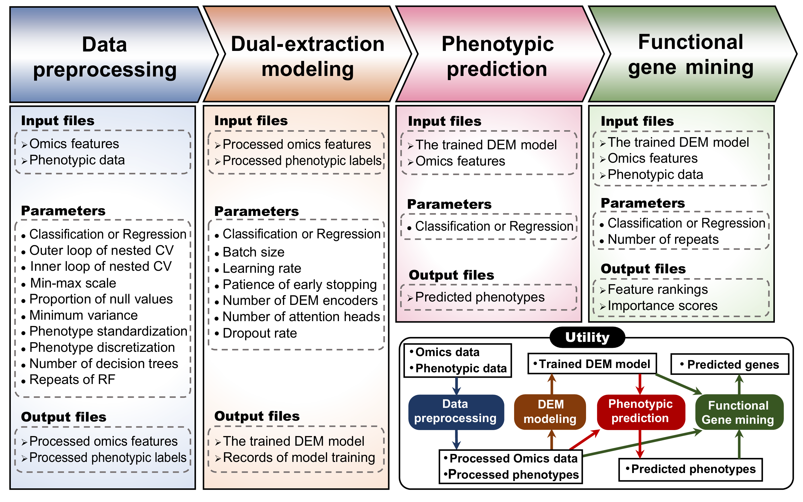

<div align="center">

# DEM

### Dual-extraction method for phenotypic prediction and functional gene mining

[](https://pypi.org/project/biodem)
[](https://pypi.org/project/biodem)
[](https://opensource.org/licenses/MIT)

</div>

+ The **DEM** software comprises 4 functional modules: data preprocessing, dual-extraction modeling, phenotypic prediction, and functional gene mining.  




<br></br>

## Installation

### System requirements
+ Python 3.11.
+ Graphics: GPU with [PyTorch](https://pytorch.org) support.
> Recommended: NVIDIA graphics card with 12GB memory or larger.

### Install `biodem` package
> [Conda](https://conda.io/projects/conda/en/latest/index.html) / [Mamba](https://mamba.readthedocs.io/en/latest/installation/mamba-installation.html) or virtualenv is recommended for installation.

1. Create a conda environment:
    ```sh
    conda create -n dem python=3.11
    conda activate dem

    # Install PyTorch with CUDA support
    conda install pytorch torchvision torchaudio pytorch-cuda=12.1 -c pytorch -c nvidia
    ```

2. Install biodem package:
    + Simple installation from [PyPI](https://pypi.org/project/biodem)
        ```sh
        pip install biodem
        ```

#### Test installation
A pipeline for testing is provided in [**`./test/test_biodem.py`**](./test/test_biodem.py). *It's also a simple usage example of `biodem`.*
```sh
cd test
python test_biodem.py
```

<br></br>

# DEM ([biodem](https://pypi.org/project/biodem)) includes 4 functional modules:

### 1. Data preprocessing

> **Nested cross-validation is recommended for data preprocessing, before these steps.**

+ _Steps:_
    1. Split the data into nested cross-validation folds.
    2. Imputation & standardization.
    2. Feature selection using the variance threshold method, PCA, and RF for multi-omics data.
    3. SNP2Gene transformation.
    
+ _Related functions:_

    Function | Command line tool
    --- | ---
    `filter_na_pheno` | `filter-pheno`
    `KFoldSplitter` | -
    `data_prep_ncv_regre` | [`ncv-prep-r`](#ncv-prep-r)
    `data_prep_ncv_class` | [`ncv-prep-c`](#ncv-prep-c)
    `impute_omics` | [`dem-impute`](#dem-impute)
    `select_varpca` | [`dem-select-varpca`](#dem-select-varpca)
    `select_rf` | [`dem-select-rf`](#dem-select-rf)
    `build_snp_dict` | - [Instruction (in Julia)](#transform-snps-to-genomic-embedding)
    `encode_vcf2matrix` | - [Instruction (in Julia)](#transform-snps-to-genomic-embedding)
    `process_avail_snp` | -
    `SNPDataModule` | -
    `SNP2GeneTrain` | -
    `SNP2GenePipeline` | [`dem-s2g-pipe`](#dem-s2g-pipe)
    `snp_to_gene` | -
    `train_snp2gene` | -

### 2. Dual-extraction modeling

+ It takes preprocessed multi-omics data and phenotypic data as inputs for nested cross-validation, based on which the DEM model is constructed. It is capable of performing both classification and regression tasks.
    
+ _Related function:_

    Function | Command line tool
    --- | ---
    `DEMLTNDataModule` | -
    `DEMTrain` | -
    `DEMTrainPipeline` | [`dem-train-pipe`](#dem-train-pipe)

### 3. Phenotypic prediction

+ It takes a pretrained model and omics data of new samples as inputs and returns the predicted phenotypes.

+ _Related function:_

    Function | Command line tool
    --- | ---
    `DEMPredict` | -
    `predict_pheno` | [`dem-predict`](#dem-predict)

### 4. Functional gene mining

+ It performs functional gene mining based on the trained DEM model through _feature permutation_.

+ _Related function:_

    Function | Command line tool
    --- | ---
    `DEMFeatureRanking` | -
    `rank_feat` | [`dem-rank`](#dem-rank)


---

<br></br>

## How to use `biodem`
We provide both [**command line tools**](#use-command-line-tools) and [**importable functions**](#import-biodem-in-your-python-project) for `biodem`.
> DEM is mainly implemented in Python. We also provide two Julia scripts for VCF&GFF file processing and SNP encoding.

#### Input and output file formats
Please refer to the directory [**`./data`**](./data/) for **the file formats** that will be used in following methods.

<br></br>

### Import `biodem` in your Python project
The main functions' purposes and parameters are described in related sections of [***Use command line tools***](#use-command-line-tools).
**We provide a simple example analysis pipeline in [`./test/test_biodem.py`](./test/test_biodem.py) to demonstrate how to use `biodem` in Python.**

```python
# An example:

# Use a pretrained DEM model to predict phenotypes of given omics data files
from biodem import predict_pheno

# Define the paths to your model and omics data files
model_path = 'dem_model.ckpt'
omics_file_paths = ['omics_type_1.csv', 'omics_type_2.csv']
output_dir = 'dir_predictions'

# Run the DEM model to predict phenotypes
predict_pheno(
    model_path = model_path,
    omics_paths = omics_file_paths,
    result_dir = output_dir,
    batch_size = 16,
    map_location = None,
)
```

<br></br>

### Use command line tools

> In terminal, run the command like `dem-impute --help` or `dem-impute -h` for help.

<br></br>

+ #### `ncv-prep-r`
    <br>The processing steps are the same as "[1. Data preprocessing](#1-data-preprocessing)".</br>

    ```sh
    # Usage:
    ncv-prep-r -K 5 -k 5 -i <input.csv> -o <output_dir> -t 0.01 -n 1000 -x <trait> --raw-label <labels.csv> --n-trees 2000 --na 0.1
    ```

    Parameters | Type | Required | Description
    --- | --- | --- | ---
    `-K` `--loop-outer` | int | * | Number of outer loops for nested cross-validation.
    `-k` `--loop-inner` | int | * | Number of inner loops for nested cross-validation.
    `-i` `--input` | str | * | Path to the input omics/phenotypes data.
    `-o` `--dir-out` | str | * | Path to the output directory.
    `-t` `--threshold-var` | float | * | Threshold for variance selection.
    `-n` `--n-rf-selected` | int | * | Number of selected features by random forest.
    `-x` `--trait` | str | * | Name of the phenotype column in the input data.
    `--raw-label` | str | * | Path to the raw labels data.
    `--n-trees` | int | * | Number of trees in random forest.
    `--na` | float | * | Threshold for missing value.

<br></br>

+ #### `ncv-prep-c`
    <br>The processing steps are the same as "[1. Data preprocessing](#1-data-preprocessing)"</br>
    ```sh
    # Usage:
    ncv-prep-c -K 5 -k 5 -i <input.csv> -o <output_dir> -t 0.01 -r 0.9 -x <trait> --raw-label <labels.csv> --na 0.1
    ```

    Parameters | Type | Required | Description
    --- | --- | --- | ---
    `-K` `--loop-outer` | int | * | Number of outer loops for nested cross-validation.
    `-k` `--loop-inner` | int | * | Number of inner loops for nested cross-validation.
    `-i` `--input` | str | * | Path to the input omics/phenotypes data.
    `-o` `--dir-out` | str | * | Path to the output directory.
    `-t` `--threshold-var` | float | * | Threshold for variance selection.
    `-r` `--target-var-ratio` | float | * | Target variance ratio for PCA.
    `-x` `--trait` | str | * | Name of the phenotype column in the input data.
    `--raw-label` | str | * | Path to the raw labels data.
    `--na` | float | * | Threshold for missing value.


<br></br>

+ #### `dem-impute`
    <br>The tool contains 3 steps:</br>
    1. Delete omics features with missing values exceeding 25%.
    2. Impute missing values with mean value of each feature.
    3. Min-max scaling.
    ```sh
    # Usage:
    dem-impute -I <an_omics_file_in> -O <an_omics_file_out> -i <a_phenotypes_file_in> -o <phenotypes_out> -p <NA_threshold> -m <is_minmax_omics> -z <is_zscore_phenotypes>
    ```

    Parameters | Type | Required | Descriptions
    --- | --- | --- | ---
    `-I` `--inom` | string | optional | Input a path to an omics file
    `-O` `--outom` | string | optional | Define your output omics file path
    `-i` `--inph` | string | optional | Input a path to a trait's phenotypes
    `-o` `--outph` | string | optional | Define your output phenotypes path
    `-p` `--propna` | float | optional | The allowed max proportion of missing values in a feature (DEFAULT: 0.25)
    `-m` `--minmax` | int, 0 or 1 | optional | Whether min-max scaling for omics is required (0 denotes False, 1 denotes True, DEFAULT: 1)
    `-z` `--zscore` | int, 0 or 1 | optional | Whether z-score transformation for phenotypes is required (0 denotes False, 1 denotes True)


<br></br>

+ #### `dem-select-varpca`
    
    <br>
    
    To analyze the significance of each feature across different phenotype classes and save important features, the following steps were taken:
    
    </br>
    
    1. Remove features with variance less than the given threshold.
    2. The ANOVA F value for each feature was calculated.
    3. Features with the lowest F values were sequentially removed.
    4. This process continued until the first principal component of the remaining features explained less than the given percent of the variance. 
    ```sh
    # Usage:
    dem-select-varpca -I <an_omics_file_in> -i <a_phenotypes_file_in> -O <omics_file_output> -V <var_threshold> -P <target_variance_ratio>
    ```

    Parameters | Type | Required | Descriptions
    --- | --- | --- | ---
    `-I` `--inom` | string | * | Input a path to an omics file
    `-i` `--inph` | string | * | Input a path to a trait's phenotypes
    `-O` `--outom` | string | * | Define your output omics file path
    `-V` `--minvar` | float |  | The allowed minimum variance of a feature (DEFAULT: 0.0)
    `-P` `--varpc` | float |  | Target variance of PC1 (DEFAULT: 0.5)


<br></br>

+ #### `dem-select-rf`
    <br>The random forest (RF) algorithm, based on an ensemble of the given number of decision trees, was employed to screen out representative omics features for subsequent DEM construction.</br>
    ```sh
    # Usage:
    dem-select-rf -I <an_omics_file_in> -i <a_phenotypes_file_in> -O <omics_file_output> -n <num_features_to_save> -p <validation_data_proportion> -N <num_trees> -S <random_seed_rf> -s <random_seed_sp>
    ```
    Parameters | Type | Required | Descriptions
    --- | --- | --- | ---
    `-I` `--inom` | string | * | Input a path to an omics file
    `-i` `--inph` | string | * | Input a path to a trait's phenotypes
    `-O` `--outom` | string | * | Define your output omics file path
    `-n` `--nfeat` | int | * | Number of features to save
    `-N` `--ntree` | int |  | Number of trees in the random forest (DEFAULT: 2500) (larger number of trees will result in more accurate results, but will take longer to run)
    `-S` `--seedrf` | list[int] |  | Random seeds for RF (DEFAULT: 1000, 1001, ..., 1009)


<br></br>

+ #### `dem-s2g-pipe`
    <br>The pipeline for SNP2Gene modeling and transformation based on nested cross-validation.</br>
    ```sh
    # Usaage example:
    dem-s2g-pipe -t <trait_name> -l <n_label_class> --inner-lbl <dir_label_inner> --outer-lbl <dir_label_outer> --h5 <path_h5_processed> --json <path_json_genes_snps> --log-dir <log_dir> --o-s2g-dir <dir_to_save_converted>
    ```
    Parameters | Type | Required | Descriptions
    --- | --- | --- | ---
    `-t` `--trait` | string | * | Trait name
    `-l` `--lbl-class` | int | * | Number of classes for trait
    `--inner-lbl` | string | * | Directory to inner label files
    `--outer-lbl` | string | * | Directory to outer label files
    `--h5` | string | * | Path to h5 file containing genotype data
    `--json` | string | * | Path to json file containing SNP-gene mapping information
    `--log-dir` | string | * | Directory to save log files and models
    `--o-s2g-dir` | string | * | Directory to save SNP2Gene results


<br></br>

+ #### `dem-train-pipe`
    <br>The pipeline for DEM modeling and prediction on nested cross-validation datasets with hyperparameter optimization. DEM aims to achieve high phenotypic prediction accuracy and identify the most informative omics features for the given trait.
    This tool is used to construct a dual-extraction model based on the given omics data and phenotype, through cross validation or random sampling.</br>
    ```sh
    # Usage example:
    dem-train-pipe -o <log_dir> -t <trait_name> -l <n_label_class> --inner-lbl <dir_label_inner> --outer-lbl <dir_label_outer> --inner-om <dir_omics_inner> --outer-om <dir_omics_outer>
    ```
    Parameters | Type | Required | Descriptions
    --- | --- | --- | ---
    `-o` `--log-dir` | string | * | Directory to save log files and models
    `-t` `--trait` | string | * | Trait name
    `-l` `--lbl-class` | integer | * | Number of classes for trait
    `--inner-lbl` | string | * | Directory to inner label files
    `--outer-lbl` | string | * | Directory to outer label files
    `--inner-om` | string | * | Directory to inner omics files
    `--outer-om` | string | * | Directory to outer omics files


<br></br>

+ #### `dem-predict`
    <br>Predicts the phenotype of given omics data files using a trained DEM model.</br>
    ```sh
    # Usage example:
    dem-predict -m <model_file_path> -o <phenotype_output> -I <omics_files>
    ```
    Parameters | Type | Required | Descriptions
    --- | --- | --- | ---
    `-I` `--inom` | list[string] | * | Input path(s) to omics file(s)
    `-m` `--inmd` | string | * | The path to a pretrained DEM model
    `-o` `--outdir` | string | * | The directory to save predicted phenotypes


<br></br>

+ #### `dem-rank`
    <br>Assess the importance of features by contrasting the DEM model’s test performance on the actual feature values against those where the feature values have been randomly shuffled. Features that are ranked highly are then identified. </br>
    ```sh
    # Usage example:
    dem-rank -I <omics_file_path> -i <pheno_file_path> -t <trait_name> -l <n_label_class> -m <model_path> -o <output_dir> -b <batch_size> -s <seed1> <seed2>...
    ```
    Parameters | Type | Required | Descriptions
    --- | --- | --- | ---
    `-I` `--inom` | string | * | Input path(s) to omics file(s)
    `-i` `--inph` | string | * | Input a path to a trait's phenotypes
    `-t` `--trait` | string | * | The name of the trait to be predicted
    `-l` `--lbl-class` | int | * | Number of classes for the trait (1 for regression)
    `-m` `--inmd` | string | * | The path to a pretrained DEM model
    `-o` `--outdir` | string | * | The directory to save ranked features
    `-b` `--batch-size` | int |  | Batch size for feature ranking (default: 16)
    `-s` `--seeds` | integer |  | Random seeds for ranking repeats (default: 0-9)


<br></br>

## Transform SNPs to Genomic Embedding

1. **Build a dict of SNPs and their corresponding genomic regions**
    + It accepts a VCF file and a GFF file (reference genome) as input, and returns a dictionary of SNPs and their corresponding genomic regions.
2. **One-hot encode SNPs**
    + It accepts a dictionary of SNPs and their corresponding genomic regions, and returns one-hot encoded SNPs based on the actual di-nucleotide composition of each SNP.
3. **Transform encoded SNPs to genomic embedding**
    + The one-hot encoded SNPs are transformed into dense and continuous features that represent genomic variation (each feature corresponds to a gene).

## Requirements
1. Please [install `biodem`](#installation) first.
2. Install [Julia](https://julialang.org) 1.10 .
3. Install the following Julia packages:
    ```sh
    # Open Julia REPL
    julia
    ```
    ```julia
    # In Julia REPL
    using Pkg
    Pkg.add("JLD2")
    Pkg.add("HDF5")
    Pkg.add("JSON")
    Pkg.add("GFF3")
    Pkg.add("GeneticVariation")
    Pkg.add("CSV")
    Pkg.add("DataFrames")
    ```

## Input and output file formats
Please refer to **the example files** in [`./data/`](./data/) for **the file formats** that will be used in following functions.

<br></br>

### Example usage

- Build a dictionary of SNPs and their corresponding genomic regions from a VCF file and a GFF file. The one-hot encoded SNPs are saved to a H5 file.
```sh
# In shell, enter Julia REPL
julia
```
```julia
# In Julia REPL

# Import functions from git repository
include("./src/biodem/utils_vcf_gff.jl")
include("./src/biodem/utils_encode_snp_vcf.jl")

# Build a dict of SNPs and their corresponding genomic regions
path_gff = "example.gff"
path_vcf = "example.vcf"
build_snp_dict(path_vcf, path_gff, true, true)

# One-hot encode SNPs
path_snp_dict = "snp_dict.jld2"# The output of build_snp_dict function
encode_vcf2matrix(path_snp_dict, true)
```

- Pick up available SNPs and their corresponding genomic regions from the H5 file produced by `encode_vcf2matrix` function.
```python
# In Python

# Import function for processing available SNPs
from biodem import process_avail_snp

path_json_snp_gene_relation = "gene4snp.json"
path_h5_snp_matrix = "snp_and_gene4snp.h5"

process_avail_snp(path_h5_snp_matrix, path_json_snp_gene_relation)
# The output will be a new H5 file containing only available SNPs and their corresponding genomic regions.
```

- Train SNP2Gene models
Please refer to the [`dem-s2g-pipe`](#dem-s2g-pipe) and [`snp_to_gene`](./src/biodem/module_snp.py) function for more details.

---

## Directory structure
```sh
.
├── src                        # Python and Julia implementation for DEM
├── data                       # Data files and example files
├── test                       # Easy tests for packages and pipelines
├── pyproject.toml             # Python package metadata
├── LICENSE                    # License file
└── README.md                  # This file

./src/biodem
├── __init__.py                # Initialize the Python package
├── cli_dem.py                 # Command line interface for DEM
├── utils.py                   # Utilities for modeling and prediction
├── module_data_prep.py        # Data preprocessing
├── module_data_prep_ncv.py    # Data preprocessing for nested cross-validation
├── module_snp.py              # SNP2Gene modeling pipeline for SNP preprocessing
├── module_dem.py              # DEM modeling pipeline, Phenotypic prediction, and Functional gene mining
├── model_dem.py               # DEM model definition
├── model_snp2gene.py          # SNP2Gene model definition
├── utils_vcf_gff.jl           # Utilities for VCF and GFF file processing
└── utils_encode_snp_vcf.jl    # Utilities for one-hot encoding SNPs
```

<br></br>

# Asking for help
If you have any questions please:
+ Contact us via [GitHub](https://github.com/cma2015/dem/issues).
+ [Email](mailto:ryl1999@126.com) us.
