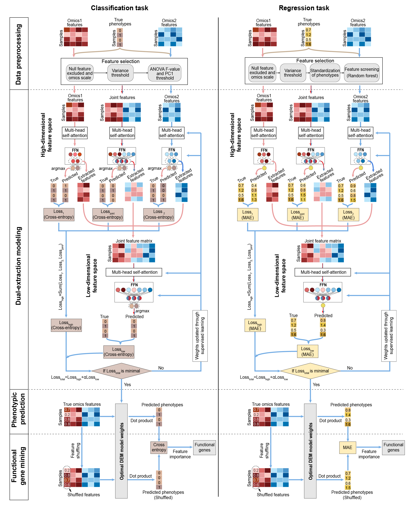

# Welcome to DEM documentation!

---

# Dual-Extraction Modeling (DEM): A multi-modal deep-learning architecture for phenotypic prediction and functional gene mining of complex traits

[DOI: 10.1016/j.xplc.2024.101002](https://doi.org/10.1016/j.xplc.2024.101002)

A multi-modal deep-learning architecture designed to extract representative features from diverse omics datasets. DEM enables robust and precise prediction of qualitative and quantitative traits phenotypes.

### Key Features:
- **Multi-Modal Deep Learning**: DEM efficiently integrates heterogeneous omics data for both classification and regression tasks.
- **High Accuracy & Generalizability**: Benchmarking experiments demonstrate DEM’s superior accuracy, robustness, and flexibility across various complex trait predictions.
- **Explainability**: DEM excels at identifying pleiotropic genes, such as those influencing flowering time and rosette leaf number, with impressive Explainability.
- **User-Friendly Software**: The repository includes easy-to-use tools for seamless application of DEM.

The **DEM** is implemented in the Python package [**`biodem`**](https://pypi.org/project/biodem), which comprises 4 modules:

- Data preprocessing
- Dual-extraction modeling
- Phenotypic prediction
- Functional gene mining

