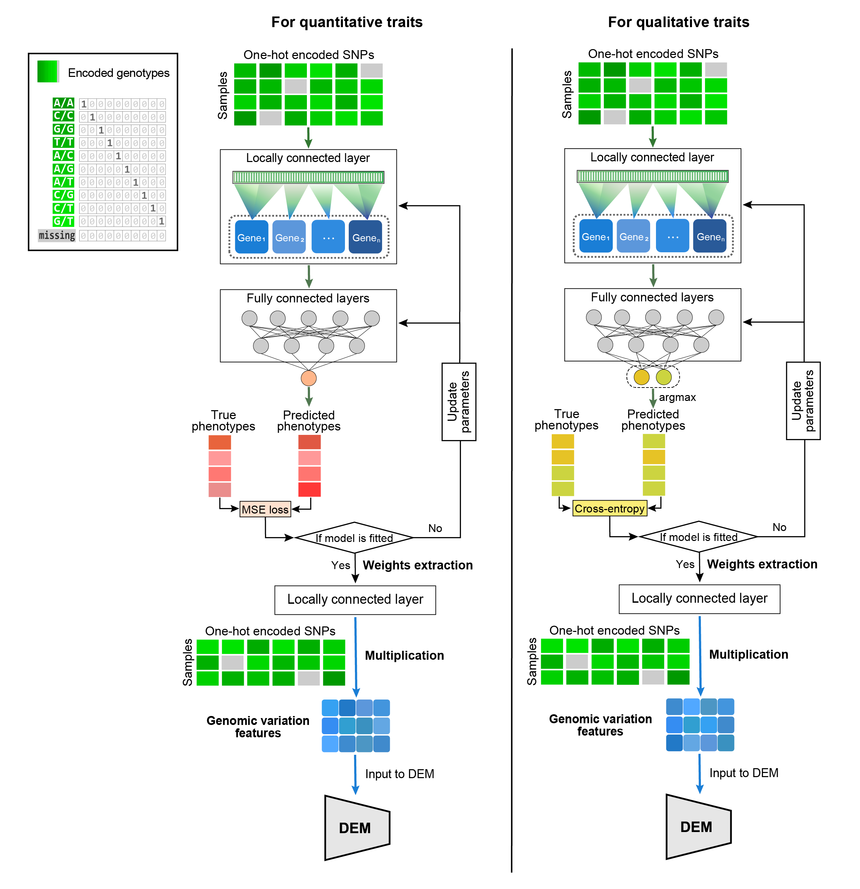

# How to use `biodem.s2g`

> If you have genomic variants and a reference genome's annotations, please encode SNPs into dense and continuous feature vectors that can be used for downstream analysis.



## 1. Search and encode SNPs

We provide a fast & lightweight tool **`pregv`** for VCF & GFF file processing and SNP encoding.

```sh
$ pregv --help
Encode genotypes from VCF file based on GFF info.

Usage: pregv <COMMAND>

Commands:
  gff2bin  Build GFF dict
  vcf2enc  Encode genotypes from VCF file based on GFF info.
  help     Print this message or the help of the given subcommand(s)

Options:
  -h, --help     Print help
  -V, --version  Print version

```

### 1.1 Build GFF dict

+ Input file: a GFF file.

```sh
$ pregv gff2bin --help
Build GFF dict

Usage: pregv gff2bin --input-gff <gff> --output <output>

Options:
  -g, --input-gff <gff>  Input GFF file.
  -o, --output <output>  Output bin.gz file.
  -h, --help             Print help
  -V, --version          Print version

```

### 1.2 Encode genotypes from VCF file

+ Input files: a VCF file and a dictionary of GFF.
+ Output: one-hot encoding SNPs based on the actual di-nucleotide composition.

```sh
$ pregv vcf2enc --help
Encode genotypes from VCF file based on GFF info.

Usage: pregv vcf2enc [OPTIONS] --input-vcf <vcf> --input-gffdict <gffdict> --output <output>

Options:
  -v, --input-vcf <vcf>          Input VCF file
  -d, --input-gffdict <gffdict>  Input GFF dict file
  -o, --output <output>          Output pickle file
  -s, --strand <strand>          Use "+", "-" or "."(both) to specify strand [default: .]
  -m, --more-mem                 Use more RAM
  -t, --threads <nthreads>       Number of threads [default: 0]
  -h, --help                     Print help
  -V, --version                  Print version

```


## 2. Transform encoded SNPs to genomic embeddings

+ The one-hot encoding SNPs are transformed into dense and continuous features that represent genomic variation (each feature corresponds to a gene).

### 2.1 Nested cross-validation and data preprocessing

Please checkout the documentations at [Modules > Utilities > Preprocessing Data > `OptimizeLitdataNCV`](biodem.utils.data_ncv.md#biodem.utils.data_ncv.OptimizeLitdataNCV).

This is an example of running the module:

``` py title="run_s2g_prep.py"
import os
import sys
from biodem import OptimizeLitdataNCV


trait_name = sys.argv[1]
which_o = int(sys.argv[2])
which_i = int(sys.argv[3])

if trait_name.startswith("all"):
    which_trait = None
else:
    which_trait = [trait_name]


if __name__ == "__main__":
    k_outer = 10
    k_inner = 5
    dir_home = os.path.dirname(os.path.abspath(__file__))
    output_dir = os.path.join(dir_home, "run_s2g", trait_name, "litdata")
    path_gt = os.path.join(dir_home, "data_prep", "snp.pkl.gz")
    path_labels = os.path.join(dir_home, "data_prep", "phenotypes.csv")

    _opt = OptimizeLitdataNCV(
        paths_omics={"gv": path_gt},
        path_label=path_labels,
        output_dir=output_dir,
        k_outer=k_outer,
        k_inner=k_inner,
        which_outer_inner=[which_o, which_i],
        col2use_in_labels=which_trait,
    )
    _opt.run_optimization()
```

### 2.2 S2G modeling

Please checkout the documentations at [Modules > S2G > Pipeline > `SNP2GBFitPipe`](biodem.s2g.pipeline.md#biodem.s2g.pipeline.SNP2GBFitPipe).

This is an example of running the module:

``` py title="run_s2g_fit.py"
import os
import sys
from biodem import SNP2GBFitPipe


if len(sys.argv) < 2:
    raise ValueError('Please specify the TRAIT NAME')
trait_name = sys.argv[1]

if len(sys.argv) < 4:
    print('Start default NCV: 10 outer folds and 5 inner folds')
    list_ncv = [[i,j] for i in range(10) for j in range(5)]
else:
    print('Start with NCV: {} outer folds and {} inner folds'.format(sys.argv[2], sys.argv[3]))
    list_ncv = [[int(sys.argv[2]), int(sys.argv[3])]]

work_dir_home = os.path.join(os.path.dirname(os.path.abspath(__file__)), "run_s2g", trait_name)
litdata_dir = os.path.join(work_dir_home, 'litdata')
is_regression = True
log_dir = os.path.join(work_dir_home, 'models')
n_jobs = 1
n_trials = 12


if __name__ == '__main__':
    pipe_fit = SNP2GBFitPipe(
        litdata_dir=litdata_dir,
        list_ncv=list_ncv,
        log_dir=log_dir,
        regression=is_regression,
        n_jobs=n_jobs,
        n_trials=n_trials,
    )
    pipe_fit.train_pipeline()
```

### 2.3 S2G Transformation

Please checkout the documentations at [Modules > S2G > Pipeline > `SNP2GBTransPipe`](biodem.s2g.pipeline.md#biodem.s2g.pipeline.SNP2GBTransPipe).

This is an example of running the module:

``` py title="run_s2g_transf.py"
import os
import sys
from biodem import SNP2GBTransPipe


if len(sys.argv) < 2:
    raise ValueError('Please specify the TRAIT NAME')
trait_name = sys.argv[1]

if len(sys.argv) < 4:
    print('Start default NCV: 10 outer folds and 5 inner folds')
    list_ncv = [[i,j] for i in range(10) for j in range(5)]
else:
    print('Start with NCV: {} outer folds and {} inner folds'.format(sys.argv[2], sys.argv[3]))
    list_ncv = [[int(sys.argv[2]), int(sys.argv[3])]]

work_dir_home = os.path.join(os.path.dirname(os.path.abspath(__file__)), "run_s2g", trait_name)
litdata_dir = os.path.join(work_dir_home, 'litdata')
models_dir = os.path.join(work_dir_home, "models")
output_dir = os.path.join(work_dir_home, "transf")

if __name__ == '__main__':
    pipe_transf = SNP2GBTransPipe(
        dir_log=models_dir,
        dir_output=output_dir,
    )
    pipe_transf.convert_snp(
        dir_litdata=litdata_dir,
        list_ncv=list_ncv,
    )
```
